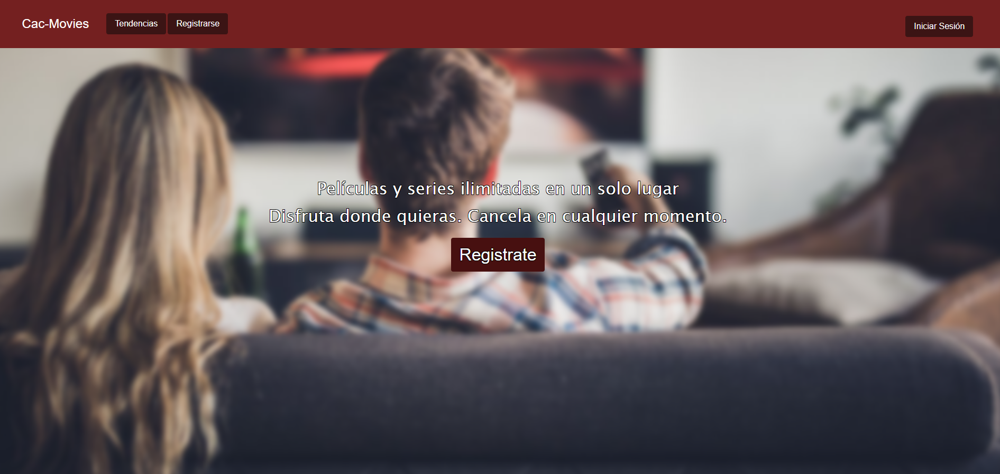

Proyecto realizado para el curso Fullstack Java 2024 - Codo a Codo

This project simulates a Netflix-style website, currently connected to a backend system implemented using Spring.

La página web simula una página de peliculas al estilo Netflix, actualmente conectado con un sistema de backend implementado en Spring.

